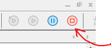
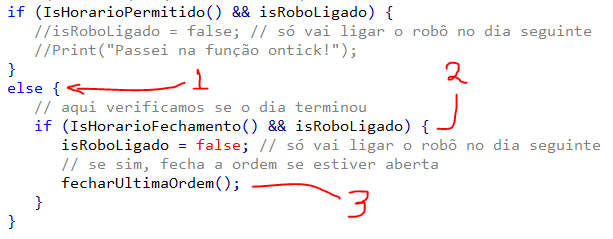

# Criando Robô Trader MQL5

## Introdução

Neste tutorial você vai aprender a criar um robô trader para MetaTrader 5 capaz de acompanhar o fluxo de velas (candles), enviar ordens de compra e de venda; além de executar essas ordens para obter lucro ou prejuízo, dependendo da regra mais básica de mercado: lei da oferta e da procura!

Sim, ganhamos dinheiro no mercado quando enviamos ordens de compra e o preço aumenta, e de forma análoga, quando enviamos ordens de venda e o preço desce! Caso contrário estaremos perdendo dinheiro no mercado!

O robô trader também analisa indicadores gráficos! No caso do nosso tutorial veremos um indicador bem simples que é a Média Móvel de 100 períodos, mas que pode nos ajudar a saber se o preço está desviado da média dos últimos 100 períodos e fazer alguma coisa com essa informação.

> 100 períodos no day trade com gráfico de velas de 5 minutos estamos, falando de mais ou menos 1 dia de velas para calcular a média. A ideia aqui é adivinhar o que vai acontecer no futuro analisando o passado!

A linguagem de programação que usaremos se chama MQL5 e relembra o C++, mas não precisa se preocupar, vamos fazer um passo-a-passo te ensinando a instalar funções que cumprem tarefas em vez de ter que ficar ensinando os pormenores de MQL5.

> Até porque o MQL5 tem uma documentação extensa de todas suas funcionalidades, e o melhor, em português! Siga o [link](https://www.mql5.com/pt/docs)!

Então para resumir, nesse tutorial veremos como criar um robô do início até o ponto em que criamos e testamos uma primeira regra de ação que chamamos de setup. 

Veremos no testador de estratégias se a regra está se mostrando válida e se estamos prontos para abrir uma conta na corretora. 

> Mas essa etapa da corretora ainda vai ficar para um próximo tutorial!

Vamos lá e boa sorte! Vamos ganhar dinheiro (ou pelo menos tentar) com robôs traders, na bolsa de valores!

## Conceitos para se estudar ao criar setups para robôs trader

- Modos de Operação
  - Modo Hedge
  - Day Trade
  - Swing Trade
- Tipos de Análises Mercadológicas
  - Análise Fundamentalista
  - Análise Gráfica
  - Price Action
- Gráficos
  - Tempos gráficos (M1, M5, H4 etc)
  - Indicadores (Tendência, volume etc)
- Corretoras de valores
  - Conta real e demo (plataforma MetaTrader5)
  - Slipagem (escorregar o preço, afeta mais o price action)
  - Taxas de stop compulsório
  - Deságio de garantias
  - Alavancagem
- B3 - Bolsa
  - Tarifas
  - Impostos

## O que esperar desse tutorial?

Neste tutorial vamos fazer um robô capaz de executar uma regra de análise gráfica, muito utilizada pelos traders pelo mundo, e enviar ordens de compra ou de venda, dependendo desta regra programada.

Vamos fazer também `backtests` que são testes de estratégia, para validar a regra do robô contra cenários passados do mercado, que nada mais é senão rodar o robô contra o histórico de preços do mercado.

> Neste tutorial NÃO veremos como configurar uma conta na corretora nem como operar em conta `demo`, mas vou preparar um próximo tutorial para isso.


## Parte 1 - Criando o Robô

> Antes de mais nada navegue até o [site oficial do MetaTrader 5](https://www.metaquotes.net/en/metatrader5) e faça o download do programa! Role a página até o final para ver o botão de download.

> A instalação do MetaTrader 5 é totalmente automática, bastando ir clicando no botão `Próximo` e no final clicar no botão `Concluir`.

> Não se preocupe com login de contas de investimento, pois o MetaTrader 5 já vem instalado com uma conta gerada automaticamente para testes!

### Agora mãos à obra!

Abra o MetaTrader 5 e clique no ícone da IDE (interface integrada de desenvolvimento), conforme segue:


Na IDE, verifique o `Navegador` no lado esquerdo da tela, expanda os nós e clique com o botão direito do mouse na pasta `Experts (1)` para exibir o menu de contexto. Clique então na opção `Novo arquivo (2)`.


> Você também pode usar a tecla de atalho `CTRL+N`.

Na primeira tela que aparecer, escolha a primeira opção `Expert Advisor (modelo)` e clique em avançar.


Na próxima tela, digite um nome para o seu robô, no meu caso eu digitei o nome `RoboTutorial4`.

> Pois eu já tinha criado outros 3 tutoriais, mas você pode escolher o nome que mais lhe agrade.


Depois clique em avançar e aceite as opções padrão em todas as telas que aparecerem:


Clique em `avançar` e `concluir` até chegar no código:


A parte do código que vamos efetivamente atuar é essa aqui:

```cpp
//+------------------------------------------------------------------+
//| Expert initialization function                                   |
//+------------------------------------------------------------------+
int OnInit()
  {
//---
   
//---
   return(INIT_SUCCEEDED);
  }
//+------------------------------------------------------------------+
//| Expert deinitialization function                                 |
//+------------------------------------------------------------------+
void OnDeinit(const int reason)
  {
//---
   
  }
//+------------------------------------------------------------------+
//| Expert tick function                                             |
//+------------------------------------------------------------------+
void OnTick()
  {
//---
   
  }
//+------------------------------------------------------------------+
```

- `OnInit()` - função executada quando seu código roda pela primeira vez, ou seja, quando você adiciona ele a um gráfico.
- `OnDeinit()` - função executada antes do seu robô ser removido do gráfico, ou seja, uma rotina de limpeza antes de encerrar.
- `OnTick()` - essa é a função que nos interessa, pois ela executa toda vez que a cotação do preço é atualizada. Essa função roda milhares de vezes por segundo e não representa uma medida de tempo, mas de quantidade de atualizações de preço. Devemos tomar cuidado para não travar ou deixar o robô lento ao adicionar muito código nesta sessão.

## Parte 2 - Programando o Robô

Vamos primeiro criar uns parâmetros de configuração para que nosso robô possa ser configurado ao ser ligado em um gráfico.

Abra espaço antes da função `OnInit()` e cole o seguinte código:

```cpp
#include<Trade\Trade.mqh>
//+------------------------------------------------------------------+
//| Input de parâmetros                                              |
//+------------------------------------------------------------------+
input double   Volume         = 1;           // Quantidade Inicial de Contratos
input string   HoraInicial    = "09:00";     // Horário de Início para novas operações
input string   HoraFinal      = "17:30";     // Horário de Término para novas operações
input string   HoraFechamento = "17:50";     // Horário de Fechamento para posições abertas
input double   LimiteGanho    = 75.0;       // Limite de ganho
input double   LimitePerda    = -50.0;       // Limite de perda
```

De forma que nosso código completo fique assim:

```cpp
//+------------------------------------------------------------------+
//|                                                RoboTutorial4.mq5 |
//|                                  Copyright 2021, MetaQuotes Ltd. |
//|                                             https://www.mql5.com |
//+------------------------------------------------------------------+
#property copyright "Copyright 2021, MetaQuotes Ltd."
#property link      "https://www.mql5.com"
#property version   "1.00"
#include<Trade\Trade.mqh>
//+------------------------------------------------------------------+
//| Input de parâmetros                                              |
//+------------------------------------------------------------------+
input double   Volume         = 1;           // Quantidade Inicial de Contratos
input string   HoraInicial    = "09:00";     // Horário de Início para novas operações
input string   HoraFinal      = "17:30";     // Horário de Término para novas operações
input string   HoraFechamento = "17:50";     // Horário de Fechamento para posições abertas
input double   LimiteGanho    = 75.0;       // Limite de ganho
input double   LimitePerda    = -50.0;       // Limite de perda
//+------------------------------------------------------------------+
//| Expert initialization function                                   |
//+------------------------------------------------------------------+
int OnInit()
  {
//---
   
//---
   return(INIT_SUCCEEDED);
  }
//+------------------------------------------------------------------+
//| Expert deinitialization function                                 |
//+------------------------------------------------------------------+
void OnDeinit(const int reason)
  {
//---
   
  }
//+------------------------------------------------------------------+
//| Expert tick function                                             |
//+------------------------------------------------------------------+
void OnTick()
  {
//---
   
  }
//+------------------------------------------------------------------+
```

> A partir de agora não vou mais mostrar o código inteiro para evitar esse documento ficar muito extenso, portanto só vou mostrar os trechos de código e onde adicioná-los. E para ver o código completo, acesse o [código fonte no github](http://linkaqui.com).

Continuando, adicione também a declaração das variáveis de tempo que vamos usar para controlar se podemos fazer operações, ou seja se estamos dentro do horário de funcionamento da B3.

> Vamos fazer testes usando contas `Forex` internacionais, mas esse robô foi feito para rodar na bolsa de valores brasileira, então precisamos de controle mais rígidos de tempo, principalmente horário para iniciar ou encerrar operações.

Agora, adicione o código a seguir após os `Inputs de parâmetros` e antes da função `OnInit()`:

```cpp
//+------------------------------------------------------------------+
//| // Classes para controle de tempo                                |
//+------------------------------------------------------------------+
MqlDateTime hora_inicial, hora_final, hora_fechamento;
```

Já temos então as variáveis de tempo e os parâmetros de configuração, portanto vamos verificar na iniciação do robô se os parâmetros inseridos de horário são válidos.

Para isso adicione o código abaixo bem no final do arquivo:

```cpp
bool CheckTimeParameters() {
   // Inicialização das variáveis de tempo
   TimeToStruct(StringToTime(HoraInicial), hora_inicial);
   TimeToStruct(StringToTime(HoraFinal), hora_final);
   TimeToStruct(StringToTime(HoraFechamento), hora_fechamento);
   // Verificação de inconsistências nos parâmetros de entrada
   return  !(hora_inicial.hour > hora_final.hour || (hora_inicial.hour == hora_final.hour && hora_inicial.min > hora_final.min))
         || hora_final.hour > hora_fechamento.hour || (hora_final.hour == hora_fechamento.hour && hora_final.min > hora_fechamento.min);
}
```

Esta é uma função para verificar se os parâmetros de hora indicados pelo usuário ao ligar o robô são válidos, senão serão inúteis para controlarmos os limites de horários do dia.

> Lembre-se que estamos fazendo um robô de day trade `SEM` modo Hedge, então é importante que fechemos as nossas posições antes do fechamento do pregão (do dia), senão podemos tomar um stop compulsório e isso tem taxas altíssimas!!!

Para usar essa função, vamos adicionar a verificação de parâmetros de horário no método `OnInit()`, pois assim verificamos logo no começo se tem alguma coisa errada e podemos abortar o programa, se necessário, assim:

```cpp
int OnInit()
  {
//---
   // Verifica os parametros de hora inicial e de fechamento do pregao
   if (!CheckTimeParameters()) {
      Print("Os horários fornecidos estão inválidos.");
      return INIT_FAILED;
   }
//---
   return(INIT_SUCCEEDED);
  }
```

Pronto, agora garantimos que os horários fornecidos pelo usuário não são inválidos, mas se forem, já retornamos `INIT_FAILED` e o robô nem inicia sua operação, sendo abortado antes do início!

> 
> Repare também na função `Print()` que imprime mensagens no diário de operações:
> 
> 
> 
> No caso, estamos usando a função `Print()` para, quando aconteça um erro, seja exibida uma mensagem no diário, informando o que deu errado:
> 
> ```cpp
> Print("Os horários fornecidos estão inválidos.");
> ```
> 

Clique então no botão `Compilar` para verificar se está tudo correto:


> `Nota:` você pode também apertar a tecla `F7`.

> `Nota2:` lembre-se sempre de salvar seu trabalho com as teclas `Ctrl+S`. Mas a tecla `F7` já faz isso, salva e compila para verificar se o código está íntegro.

### Conta Demo do MetaTrader

O MetaTrader 5 já vem com uma conta Demo configurada e ativada! Podemos usá-la para testes!


Além disso, já vem com USD 10.000,00 para fazermos testes!

> Mas calma, não vamos precisar gastar esse dinheiro de testes ainda, vamos usar o `backtest` para simular em cima de dados históricos.

### Backtest do MetaTrader 5

Primeiro abra o testador de estratégias (`backtester`), voltando ao MetaTrader 5, indo no menu `Exibir (1)` e depois em `Testador de Estratégia (2)`.


> Nota: Você pode ativar o testador de estratégias também pelo atalho de teclado `CTRL+R`.

No testador de estratégia selecione o robô trader, no meu caso o `RoboTutorial4`:


Então selecione o campo `Ativo` como sendo `Forex / EURUSD, Euro vs US Dollar`, conforme a imagem abaixo:


Escolha um período para testar, para isso selecione `Período personalizado` e atribua uma data inicial e final para determinar o período de execução:


> Nota: Lembre-se de testar períodos diferentes para validar um setup!

Mais um detalhe! Selecione o `timeframe (1)` do gráfico! 

> Esse passo é muito importante! Pois as velas dos gráficos se formam diferentemente em cada timeframe e isso afeta muito o funcionamento do robô, a granularidade dos indicadores técnicos, etc. Então preste muita atenção nessa configuração! 

No nosso caso, vou usar `M5 (2)`, que forma velas de 5 em 5 minutos, conforme segue:


O próximo parâmetro do testador de estratégias é a Latência, que simula atrasos comuns entre a comunicação do computador que está rodando o robô com os servidores da corretora.


Veja que temos algumas opções automáticas na caixa de seleção, que são `(1) Sem atrasos, execução perfeita` e `(2) 227 ms (o último ping do seu servidor)`. 

> Nota: No caso 227 é o ping do meu, o seu deve aparecer de forma diferente, pois é automático. 

Eu costumo escolher a latência de 5 ms e pra gente não faz muita diferença. 

> Nota 2: A não ser que você esteja construindo um robô de price action. Para um robô de price action a slipagem faz muito efeito, mas não é o tema do curso aqui. Vamos em frente.

Agora precisamos escolher a modelagem de teste de estratégia. No nosso caso vamos usar “OHLC por 1 minuto” pois vai deixar o nosso teste mais leve.

> Nota 3: OHLC é um acrônimo para Open, Close, Low and High. Então teremos os preços de cada momento da vela 1 vez por minuto. É isso que significa essa configuração.

> Nota 4: Se você estiver montando um robô de price action provavelmente você preferirá escolher “Cada tick” no seletor de modalidade. No nosso caso, como é um robô de análise gráfica, utilizaremos indicadores e não precisaremos verificar os preços e indicadores a cada Tick, podemos verificar apenas a cada fechamento de vela.

Para as últimas configurações, eu digitei um depósito inicial de `300 dólares (1)`, depois eu deixei a configuração padrão de alavancagem `1:100 (2)`, e além disso `desabilitei a otimização (3)`, finalmente deixando ativo `o modo de exibição visual (4)`.


> Nota: Alavancagem vamos estudar no próximo tutorial.

> Nota 2: modos de otimização e exibição visual são modos de visualizar os resultados no testador de estratégias, não se preocupe com isso agora.

Clique no botão iniciar para começar o testador de estratégias:


Então espere um pouco para aparecer a janela da Visualização do Testador de Estratégias:


> Nota: Pode demorar um pouco para começar, pois talvez o MetaTrader precise primeiro baixar os dados históricos.

Pronto, você executou seu primeiro teste de estratégia!

## Parte 3 - Depurando código

Agora que já escrevemos algum código e vimos rodando no testador de estratégias, vamos quebrar alguma coisa para ver nosso robô reagir de acordo!

Primeiro vamos ver as configurações do robô. Para isso,  voltando no MetaTrader 5, no testador de estratégias, clique na aba  `Parâmetros de entrada (1)`. 


> Nota: Lembra dos parâmetros que colamos no código logo no início do tutorial? Pois olha eles aí! É por aí que configuramos o nosso robô durante os testes de estratégias.

Bom, mas clique no campo do `Horário de Início (2)` para inserirmos uma hora inválida. Lembra que codificamos para que o robô detecte uma hora inválida? Vamos por isso à prova!

Mude para um horário inválido como: `49:66`, ou seja, qualquer coisa que não seja uma hora válida. Vamos ver como nosso robô reage.

Clique novamente no botão Iniciar:


Agora na janela de visualização do testador de estratégias, clique na aba `Diário` para ver o registro de atividade do robô.


Repare que o robô parou pois retornou um código não-zero, ou seja, o nosso validador funcionou e não autorizou o uso do parâmetro `HoraInicial` com o valor `49:66` como eu indiquei!


Veja que a mensagem de que os horários fornecidos não são válidos também aparece! Mais uma indicação de que estamos no caminho certo!


Bom, feito esse teste, pode voltar nos parâmetros e arrumar os horários, pois agora vamos realmente criar alguma regra para executar!

## Parte 4 - Preparando o Robô

Uma das regras mais simples de se criar para um robô é usar o cruzamento do preço pela média móvel, como sinal de entrada.

> Nota: Você pode usar sinais externos também, API’s, fornecedores de serviço que sejam compatíveis com padrão HTTP.

> Nota 2: Imagine conseguir reunir todos os dados do investing.com e acessar através do seu robô, e usar como sinais de entrada para operações!

No nosso caso vamos usar o cruzamento da média de 100 períodos para nos sinalizar uma entrada no mercado!

Mas primeiro vamos entender como funciona a função `OnTick()` do MetaTrader 5.

Lembra que configuramos o `OHCL` para 1 minuto? Então, vamos entender isso agora, pois vamos adicionar um código temporário no nosso robô só para testar isso.

Adicione um código de `Print()` para verificarmos o funcionamento da função `OnTick()`, conforme abaixo:

```cpp
//+------------------------------------------------------------------+
//| Expert tick function                                             |
//+------------------------------------------------------------------+
void OnTick()
  {
//---
   Print("Passei na função ontick!");
  }
//+------------------------------------------------------------------+
```

Agora clique `2x` no local indicado pela imagem abaixo, na mesma linha do `Print()` para marcarmos um ponto de interrupção.


Repare no marcador azul que aparece ao clicarmos `2x` no número da linha. Esse é o ponto de interrupção e o programa vai parar aí para tomarmos alguma atitude. 

> Nota: Pontos de interrupção (breakpoints) são marcadores para o programa parar enquanto em ambiente de desenvolvimento. Isso serve para podermos verificar os estados das variáveis, dos preços e das coisas que podem dar errado.

> Nota 2: Utilizamos comandos de teclado para avançar na depuração de código, entre eles o `F10` para executar o próximo comando, o `F11` para entrar mais fundo, e o `F5` para continuar até o próximo ponto de interrupção.

Agora para executar em modo de depuração no testador de estratégias clique no botão indicado pela imagem abaixo:


> Nota: Clique no botão azul! NÃO no botão verde! Pois o botão verde vai ligar seu robô direto na conta real ou demo que estiver configurada no momento. Melhor não fazer isso agora.

Repare que o robô vai imediatamente parar no ponto de interrupção!


E você pode teclar `F5` para continuar, ou clicar com o mouse no botão azul novamente.


Mas você vai reparar que ele insiste em ficar parando no ponto de interrupção. Isso acontece pois ele está disparando a função OnTick() uma vez por minuto, no tempo da simulação, não no nosso tempo real.

Então você pode verificar pelo diário que ele vai imprimindo a nossa mensagem umas 3 a 4 vezes por minuto:


Repare na diferença entre o Tempo e a data da Mensagem! São coisas diferentes! O tempo é o nosso tempo real de execução do robô, já a data da Mensagem é o dia que está rodando no simulador, no caso o primeiro dia de Janeiro de 2021, que é o dia 4.


Note também que ele está executando fora do horário! Não é pra ele executar as 2 da manhã, apenas depois das 9 da manhã conforme nossas configurações! Vamos corrigir isso agora!

Digite o código abaixo bem no final do arquivo para criar essa função que vai nos ajudar a verificar se estamos dentro dos horários permitidos pelos parâmetros que criamos para nosso robô.

```cpp
bool IsHorarioPermitido() {
   MqlDateTime hora_atual;
   TimeToStruct(TimeCurrent(), hora_atual); 
   if (
      hora_atual.hour >= hora_inicial.hour 
      && hora_atual.hour <= hora_final.hour
   )
   {
      if (
         (hora_inicial.hour == hora_final.hour) 
         && (hora_atual.min >= hora_inicial.min) 
         && (hora_atual.min <= hora_final.min)
      )
         return true;
      if (hora_atual.hour == hora_inicial.hour)
      {
         if (hora_atual.min >= hora_inicial.min)
            return true;
         else
            return false;
      }
      if (hora_atual.hour == hora_final.hour)
      {
         if (hora_atual.min <= hora_final.min)
            return true;
         else
            return false;
      }
      return true;
   }
   return false;
}
```

E agora vamos ajustar nossa função OnTick para ficar assim:

```cpp
void OnTick()
  {
//---
   if (IsHorarioPermitido()) {
      Print("Passei na função ontick!");
   }
  }
 ```

Veja que agora verificamos se está dentro do horário permitido. Execute de novo o robô clicando no botão azul!


Você pode abortar a execução a qualquer momento clicando no botão parar, conforme a imagem abaixo:



Outro detalhe, se você quiser desabilitar o ponto de interrupção é só clicar em cima dele 2x novamente.


Mas não desabilite ainda! Ou se você desabilitou, clique novamente 2x sobre o número da linha para habilitá-lo novamente, pois vamos testar agora a questão do horário inicial permitido para execução.

Se você reparou bem, percebeu que o ponto de interrupção não foi acionado imediatamente agora, não é mesmo!?

Isso porque definimos que o horário permitido é a partir das 09:00 da manhã, e no simulador ainda são 2 da manhã.


Você pode aumentar ou diminuir a velocidade da simulação através da barra deslizante, conforme mostrado na figura abaixo:


Você pode também ir direto para uma data e horário específicos indicando no campo de data e clicando em “Ir para…”


Faça isso e veja que o ponto de interrupção será disparado automaticamente, pois serão 09:00 da manhã!


Quando parar no ponto de interrupção, tecle `F5` para continuar. Repita isso algumas vezes, pois o robô vai insistir em executar a função `OnTick()` até o horário limite que configuramos, que é às 17:50 se eu não me engano!

E depois de teclar `F5` algumas vezes, confira os dados no diário:


Veja que o robô passou a escrever as mensagens no diário somente a partir das 09:00 da manhã! Está indo tudo conforme planejamos!

Agora clique no botão vermelho para parar a execução do robô.


Vamos adicionar mais uns códigos de controle de tempo, como por exemplo a função que descobre se é um novo dia. Digite o código abaixo bem no final do seu arquivo:

```cpp
bool IsNovoDia() {
   MqlRates _rates[];
   ArraySetAsSeries(_rates, true);
   if(CopyRates(_Symbol,_Period,0,2,_rates) > 0) 
   {
      datetime lastbar_time = _rates[0].time;
      MqlDateTime time;
      TimeToStruct(lastbar_time, time);
      if(OldDay < time.day_of_year)
      { 
         OldDay = time.day_of_year;
         return true;
      }
   } else Print("Erro ao consultar IsNovoDia no servidor!");
   return false;
}
```

Essa função nos ajuda a executar tarefas apenas 1 vez por dia, no início do pregão.

Vamos utilizá-la para ver seu efeito!

Mas antes inclua o código abaixo após a declaração de Classes para controle de tempo:

```cpp
//+------------------------------------------------------------------+
//| Declaração de variáveis                                          |
//+------------------------------------------------------------------+
static int OldDay = 0;
static bool isRoboLigado = false;
```

E então altere novamente a função `OnTick()` para implementar a verificação de novo dia, assim:

```cpp
//+------------------------------------------------------------------+
//| Expert tick function                                             |
//+------------------------------------------------------------------+
void OnTick()
  {
//---
   if (IsNovoDia()) {
      // aqui roda uma vez no início de cada dia
      isRoboLigado = true;
   } else {
      // aqui roda qualquer outra vez que não for novo dia
      if (IsHorarioPermitido() && isRoboLigado) {
         isRoboLigado = false; // só vai ligar o robô no dia seguinte
         Print("Passei na função ontick!");
      }
   }
  }
//+------------------------------------------------------------------+
```

E mantenha o ponto de interrupção no mesmo lugar, na linha do `Print()`, assim:


Dessa forma o robô rodará apenas uma vez no início do dia; e depois só rodará novamente o `Print()` no dia seguinte.

> Nota: Você entenderá em breve o sentido disso, mas adiantando o assunto é porque precisamos controlar o fluxo na função `OnTick()`, pois precisamos saber se é um novo dia, se estamos dentro do horário permitido, se fechou uma vela, essas coisas.

> Nota 2: Repare no mecanismo do `isRoboLigado`, que é uma variável que guarda o estado de funcionamento do robô. Quando é um novo dia, ligamos o robô, mas quando executamos o `Print()` dentro do horário permitido e com o robô ligado, desligamos o robô. Que só será ligado no dia seguinte. Não é eficiente esse sistema?

Agora vamos testar? Aperte o botão azul e repare que agora, cada vez que o ponto de interrupção é acionado, pulamos um dia inteiro!


Podemos ver isso pelo diário! Acesse o diário e veja que agora as datas de impressão da mensagem pulam de um dia para o outro!


Agora falta uma última função de utilidades para termos um robô apto a rodar day trade!

Vamos criar a função que detecta se uma vela terminou de fechar e outra está abrindo! Ou seja, vamos pegar exatamente o momento de mudança de uma vela para outra.

Para isso digite o código abaixo no final do seu arquivo:

```cpp
bool IsNovoCandle() {
   int local_bars = Bars(_Symbol, _Period);
   if (local_bars == 0) Print("Erro ao consultar Bars no servidor!");
   if(bars < local_bars && local_bars > 0)
   {
      if (bars != 0) {
       bars = local_bars;
       return true;
      }
      
      bars = local_bars;
       return false;
   }
   return false;
}
```

E adicione a variável `bars` na sua declaração de variáveis para ficar assim:

```cpp
//+------------------------------------------------------------------+
//| Declaração de variáveis                                          |
//+------------------------------------------------------------------+
static int OldDay = 0;
static bool isRoboLigado = false;
static int bars = 0;
```

Agora podemos editar nosso `OnTick()` para sua versão "mais ou menos" definitiva, assim:

```cpp
//+------------------------------------------------------------------+
//| Expert tick function                                             |
//+------------------------------------------------------------------+
void OnTick()
  {
//---
   if (IsNovoDia()) {
      // aqui roda uma vez no início de cada dia
      isRoboLigado = true;
   } else {
      // cada vez que uma vela terminar outra começar
      if (IsNovoCandle()) { 
         // aqui roda qualquer outra vez que não for novo dia
         if (IsHorarioPermitido() && isRoboLigado) {
            isRoboLigado = false; // só vai ligar o robô no dia seguinte
            Print("Passei na função ontick!");
         }
      }
   }
  }
//+------------------------------------------------------------------+
```

Vamos analisar esse código:


1. `IsNovoDia()` - Parte que vai rodar uma vez por dia, no início do pregão, ligando o robô e fazendo rotinas de limpeza de variáveis, etc.
2. `IsNovoCandle()` - Só executa quando é uma nova vela. Lembre-se que ele só executa essa verificação após o dia ter sido iniciado (no item 1). Ou seja, da segunda vela em diante, pois a primeira vela é a abertura do dia.
3. `IsHorarioPermitido() && isRoboLigado` - Verifica se estamos no horário de pregão e se o robô está ligado.

> Nota: Essas verificações todas vão fazer sentido em breve, mas por ora devemos ter em mente que esse robô está sendo desenvolvido para ser rodado no ativo Mini Índice da bolsa brasileira, a B3. Nossos testes no Forex são apenas testes.

> Nota 2: Essas regras também levam em consideração a operação em modo normal, ou seja, SEM hedge! Isso quer dizer que não levamos uma operação de um dia para o outro, pois se fizermos isso, tomamos um stop compulsório da corretora e taxas adicionais podem ser cobradas!

> Nota do Hedge: O modo Hedge é um modo utilizado por Swing Traders que operam visando um prazo mais longo, às vezes levando dias ou meses. Eles mantêm suas operações abertas por dias, semanas e meses; às vezes, anos! No day trade começamos e terminamos nossas operações no mesmo dia, ou seja, NÃO fazemos "Swing" para o outro dia!

### Fazendo uma primeira ordem no mercado

Bom, agora que temos o nosso robô configurado, vamos adicionar a funcionalidade de operar no mercado.

De forma geral, o que fazemos é registrar uma ordem de compra ou de venda e depois executá-la quando atingir o preço que desejamos; ou que tenha ido pro lado tão errado que desistimos e assumimos o prejuízo.

A regra que vamos usar é a de `TakeGain` para fechar a ordem ganhando e `StopLoss` para fechar a ordem com perda.

Enquanto a ordem estiver aberta, a corretora vai limitar a quantidade de perda ao seu saldo de garantias.

> Nota: Cuidado em ter garantias suficientes pois isso também gera um stop compulsório pela corretora e com certeza terá taxas adicionais.

> Nota 2: Lembra que configuramos nosso robô no testador de estratégias para ter um saldo inicial de USD 300? Esse é o saldo de garantias.

Bom, mas vamos lá! Primeiro adicione um enumerador para tipificarmos o que é ordem de compra ou de venda, assim:

```cpp
enum TIPO_ORDEM { COMPRA, VENDA, NENHUM };
```

Além disso, acrescente na sequência, a variável de negociação, chamada `trade`, assim:

```cpp
CTrade trade;
```

Adicione essas duas declarações junto com as outras variáveis, ficando assim:

```cpp
//+------------------------------------------------------------------+
//| Declaração de variáveis                                          |
//+------------------------------------------------------------------+
static int OldDay = 0;
static bool isRoboLigado = false;
static int bars = 0;
enum TIPO_ORDEM { COMPRA, VENDA, NENHUM };
CTrade trade;
```

Agora adicione as duas funções de abertura e fechamento de ordem bem lá no final do seu código:

```cpp
void fecharUltimaOrdem() {
   trade.PositionClose(_Symbol);
}

void abrirOrdem(TIPO_ORDEM s, double price, double sl, double tp) {
   if (s == COMPRA) {
      trade.Buy(Volume,_Symbol,price,sl,tp,NULL);
   }
   if (s == VENDA) {
      trade.Sell(Volume,_Symbol,price,sl,tp,NULL);
   }
}
```

Repare que a função `abrirOrdem()` recebe o tipo de ordem, o take gain (tp) e o stop loss (ls), além do preço, pois a função precisa saber se é uma operação de compra ou de venda e qual preço desejado para a ordem.

Já a função `fecharUltimaOrdem()` não recebe parâmetro nenhum pois ela apenas fecha a última ordem que foi aberta.

> Nota: No modo normal de operação colocamos uma ordem por vez no mercado, já no modo Hedge podem ser colocadas mais ordens ao mesmo tempo.

Agora vamos utilizar essas funções para fazer uma coisa bem simples, que é criar uma ordem de compra todo dia na abertura do mercado. E depois só vamos verificar se ela ainda está aberta no fechamento do pregão, se sim, a gente fecha ela manualmente.

> Nota: Lembre-se que o `TakeGain` e o `StopLoss` fecharão a ordem automaticamente, só precisaremos fechar a ordem manualmente se ela não atingiu nem o valor de ganho nem o valor de perda durante o dia.

> Nota 2: Vamos criar apenas ordem de compra para ser simples agora, depois vamos criar uma regra mais consistente.

Agora adicione mais uma função no final do seu código para verificarmos se o horário de fechamento do pregão chegou:

```cpp
bool IsHorarioFechamento() {
   MqlDateTime hora_atual;
   TimeToStruct(TimeCurrent(), hora_atual); 
   if (hora_atual.hour > hora_fechamento.hour)
      return true;
   if ((hora_atual.hour == hora_fechamento.hour) && (hora_atual.min >= hora_fechamento.min))
      return true;
   return false;
}
```

Vamos modificar novamente a função `OnTick()` para refletir essas mudanças assim:

```cpp
//+------------------------------------------------------------------+
//| Expert tick function                                             |
//+------------------------------------------------------------------+
void OnTick()
  {
//---
   if (IsNovoDia()) {
      // aqui roda uma vez no início de cada dia
      isRoboLigado = true;
      
      // Primeiro pegamos os valores atuais de preço de compra e venda
      double Ask=NormalizeDouble(SymbolInfoDouble(_Symbol,SYMBOL_ASK),_Digits);
      double Bid=NormalizeDouble(SymbolInfoDouble(_Symbol,SYMBOL_BID),_Digits);
      
      // criando uma ordem de compra no início do dia
      abrirOrdem(COMPRA, Ask, Ask - 200.0, Ask + 200.0);
      
   } else {
      // cada vez que uma vela terminar outra começar
      if (IsNovoCandle()) { 
         // aqui roda qualquer outra vez que não for novo dia
         if (IsHorarioPermitido() && isRoboLigado) {
            //isRoboLigado = false; // só vai ligar o robô no dia seguinte
            //Print("Passei na função ontick!");
         }
         else {
            // aqui verificamos se o dia terminou
            if (IsHorarioFechamento() && isRoboLigado) {
               isRoboLigado = false; // só vai ligar o robô no dia seguinte
               // se sim, fecha a ordem se estiver aberta
               fecharUltimaOrdem();
            }
         }
      }
   }
  }
//+------------------------------------------------------------------+
```

Analisando o código podemos perceber que a ordem de compra é colocada quando o `IsNovoDia()` é ativado, ou seja, cria a ordem uma vez no início do dia:


> Nota: Ask e Bid são preços de compra e de venda, respectivamente. Então usamos o preço Ask quando vamos colocar uma ordem de compra e usamos o preço Bid quando a ordem é de venda.

> Nota 2: Veja que fazemos o stop loss como o preço - 200 e o take gain como o preço + 200. Isso só vai funcionar no backtest da bolsa brasileira no ativo mini índice. Não vai funcionar no Forex! Para funcionar no Forex, divida 200 por 100.000, vamos ver isso mais adiante.



1. `Else do IsHorarioPermitido()` - vai entrar nesse `else` quando estiver fora do horário permitido de abrir ordens.
2. `IsHorarioFechamento()` - verifica se o pregão vai fechar.
3. `fecharUltimaOrdem()` - fecha a última ordem que estiver aberta.

> Nota: Repare que comentamos as linhas dentro do `IsHorarioPermitido()` pois não vamos usar essa parte agora e ela afeta a parte do fechamento.

Pronto! Agora vamos executar para ver o resultado! Clique no botão azul para iniciar o simulador de estratégias.


> Nota: Esse robô foi desenvolvido para a bolsa brasileira, mas estamos testando no histórico do Forex, no ativo EURUSD, que tem valores bem diferentes. Então para funcionar você precisa modificar o código para ficar assim:


Repare que em vez de 200, usamos 0.002, pois a escala é bem diferente no Forex.

Outro ajuste que precisa ser feito no `Parâmetros de entrada (1)` na configuração do testador de estratégias, para rodar no Forex, é mudar o Volume de 1 para `0.1 (2)`, assim:


Mas quando você for testar na bolsa brasileira, lembre-se de voltar essas configurações para trás!

Se tiver algum ponto de interrupção pode tirar ele agora e deixe rodar em uma velocidade alta para vermos o que acontece.

Vamos estudar alguns resultados. No visualizador do testador de estratégias, clique na aba `Histórico (1)` para ver as transações feitas, o lucro ou perda de cada uma:


Se não estiver aparecendo a coluna `Ganho (2)`, clique com o botão direito do mouse sobre a tabela de resultados do histórico e selecione  `Transações`, conforme abaixo:


Outro indicador interessante é o `Gráfico (1)` de ganhos versus perdas no período do teste:


Repare que temos a informação do saldo representado pela linha azul e o capital líquido que é a linha verde. Já na parte de baixo temos as marcações de depósito carregado, pois significa que estamos negativos e perdendo dinheiro do saldo inicial.


Nessa tela do resultado do `Teste de Volta (1)` temos informações muito importantes também, como o `Retorno Esperado (2)`, que informa se ganhamos ou perdemos dinheiro no período, no caso, perdemos. 

Outra informação importante é o `Rebaixamento de Saldo (3)` que nos informa se o depósito inicial não foi muito afetado durante o período, pois esse depósito funciona como um cheque especial.

Já o `Lucro Bruto e a Perda Bruta (4)`, logo abaixo do `Lucro Líquido` mostra como foi o desempenho do nosso robô, que não foi mal, considerando que não implementamos nenhuma regra ainda.

## Parte 5 - Criando uma regra para o Robô

Bom, agora chegou a hora de tentar ganhar dinheiro! Já sabemos como controlar o robô e também já vimos como operar no mercado, agora é a hora!

O que falta para tentarmos uma receita que ganhe dinheiro no mercado é escolher uma regra, ou como chamamos, um setup para seu robô. Chamamos de setup pois normalmente é um conjunto de regras, não apenas uma regra só.

Eu digo isso pois o setup que vamos praticar para nosso robô envolve coisas como:

- Onde vamos ligá-lo? 
- Em qual ativo?
- Qual timeframe?
- Qual regra de entrada e saída?

Como podemos ver temos muitas perguntas para responder, e para não complicar muito as coisas no momento vamos tentar alguma coisa simples, para começar.

- Vamos rodar no Forex mesmo, com as configurações alteradas, conforme já vimos.
- No ativo Euro/Dólar: EURUSD
- Timeframe M5
- Média Móvel 100 - Vamos criar uma regra simples em que dependendo do preço em relação à média móvel, entramos comprados ou vendidos.

A regra da Média Móvel 100 (MM100) é bem simples, bastando verificarmos se o preço atual está acima da MM100, entramos comprados, se estiver abaixo entramos vendidos, simples assim.

> Eu sei que é simples até demais, mas não podemos começar com algo complicado, temos que ir devagar, testar exaustivamente cada pequena mudança, pois envolve dinheiro! Não queremos lançar um robô com um bug que nos faça perder dinheiro!

Então vamos começar!

Primeiro precisamos de um ponteiro de memória, mas não se assuste! Basta criarmos mais uma variável na parte de variáveis chamada “handle”, assim:

```cpp
static int handle = 0;
```

Agora precisamos de uma variável para guardar a informação se abrimos ou não uma ordem, conforme abaixo:

```cpp
static bool ordemAberta = false;
```

Então nossa sessão de declaração de variáveis ficou assim:

```cpp
//+------------------------------------------------------------------+
//| Declaração de variáveis                                          |
//+------------------------------------------------------------------+
static int OldDay = 0;
static bool isRoboLigado = false;
static int bars = 0;
enum TIPO_ORDEM { COMPRA, VENDA, NENHUM };
CTrade trade;
static int handle = 0;
static bool ordemAberta = false;
```

Agora ajuste a função `OnInit()` para incluir a iniciação do indicador de média móvel, assim:

```cpp
handle = iMA(_Symbol, _Period, 100, 0, MODE_SMA, PRICE_CLOSE);
if(handle == INVALID_HANDLE) {
   Print("Erro ao capturar dados da MM100.");
   return INIT_FAILED;
}
```

Bom, vamos analisar o que esse código faz.


1. Utilizamos a função `iMA()` que cria um indicador de média móvel e passamos o parâmetro 100 para criar uma média móvel de 100 períodos.
2. `MODE_SMA` - significa que vamos utilizar o modo simples de média aritmética e não o exponencial.
3. `PRICE_CLOSE` - significa que todos os cálculos serão feitos em cima do preço de fechamento de cada vela.
4. Verificamos se não ocorreu algum problema na iniciação do indicador, se for o caso imprimimos a mensagem de erro e saímos do programa.

A média móvel nada mais faz do que tirar uma média dos preços de fechamento das últimas 100 velas. Essa média de preços nos mostra se o preço atual está na média das 100 últimas velas ou se está desviado.

A regra que usamos é bem simples, se o preço atual estiver desviado para cima da média do preço dos 100 últimos períodos, entramos comprando, se estiver abaixo entramos vendendo.

> Nota: Depois veremos que se o preço estiver muito desviado, significa uma chance maior de reverter o preço, então podemos ir adicionando regras no robô para refinar o setup.

Agora vamos adicionar um código para destruir o ponteiro de memória quando o robô for desligado. Para isso reescreva sua função `OnDeinit()` de forma que fique como está mostrado no código abaixo:

```cpp
//+------------------------------------------------------------------+
//| Expert deinitialization function                                 |
//+------------------------------------------------------------------+
void OnDeinit(const int reason)
  {
//---
   if(handle!=INVALID_HANDLE) 
      IndicatorRelease(handle);
  }
```

Esse código é importante para liberar o espaço de memória e não largar as coisas pelo caminho.

> Nota: Sempre que adicionarmos um indicador a um robô precisamos lembrar de adicionar o código de liberação de memória no `OnDeinit()`!

Agora já podemos adicionar a nova regra no robô. Vamos separar o código aqui pra ficar melhor a leitura, primeiro crie uma função exclusiva para verificarmos os dados do indicador e determinar se vamos entrar ou não na operação. Digite o código abaixo bem no fim do seu arquivo:

```cpp
void DeterminarEntrada(double sl, double tp) {
   // Primeiro pegamos os valores atuais de preço de compra e venda
   double Ask=NormalizeDouble(SymbolInfoDouble(_Symbol,SYMBOL_ASK),_Digits);
   double Bid=NormalizeDouble(SymbolInfoDouble(_Symbol,SYMBOL_BID),_Digits);
   
   double values[];
   ArraySetAsSeries(values, true);
   
   if(CopyBuffer(handle,0,0,3,values) > 0) {
   
      double indicadorMM10 = values[0];
      
      if (Ask > indicadorMM10)      
         // criando uma ordem de compra quando preço acima do indicador
         abrirOrdem(COMPRA, Ask, Ask - sl, Ask + tp);
      
      else if (Bid < indicadorMM10)      
         // criando uma ordem de venda quando preço abaixo do indicador
         abrirOrdem(VENDA, Bid, Bid + sl, Bid - tp);
   }
}
```

E agora podemos reescrever a nossa função OnInit() para ficar assim:

```cpp
//+------------------------------------------------------------------+
//| Expert tick function                                             |
//+------------------------------------------------------------------+
void OnTick()
  {
//---
   if (IsNovoDia()) {
      // aqui roda uma vez no início de cada dia
      isRoboLigado = true;
   } else {
      // cada vez que uma vela terminar outra começar
      if (IsNovoCandle()) {
         if (IsHorarioPermitido() && isRoboLigado && !ordemAberta) {
            DeterminarEntrada(0.002, 0.002);
         }
         if (IsHorarioFechamento() && isRoboLigado) {
            isRoboLigado = false;
            fecharUltimaOrdem();
         }
      }
   }
  }
//+------------------------------------------------------------------+
```

E finalmente vamos ajustar as funções de abertura e fechamento de ordens para informar quando a ordem for aberta ou fechada, assim:

```cpp
void fecharUltimaOrdem() {
   ordemAberta = false;
   trade.PositionClose(_Symbol);
}
void abrirOrdem(TIPO_ORDEM s, double price, double sl, double tp) {
   ordemAberta = true;
   if (s == COMPRA) {
      trade.Buy(Volume,_Symbol,price,sl,tp,NULL);
   }
   if (s == VENDA) {
      trade.Sell(Volume,_Symbol,price,sl,tp,NULL);
   }
}
```

### Testando a regra do Robô

Pronto! Agora temos um código que executa uma regra simples, mas vamos ver como ela se sai no testador de estratégias? Aperte o botão azul!


Vamos verificar novamente como ficou o gráfico do teste de volta?


Opa! Parece bem melhor! Tivemos bastante perda no início do período, mas depois estabilizou e aparentemente deu ganho!

Vamos conferir se deu ganho pelo relatório do teste de volta, conforme segue:


Tivemos lucro de 98,40 dólares! 
Verificando o retorno esperado podemos ver que foi positivo e é isso que queremos!

Parabéns, você fez o seu primeiro robô trader! Agora é testar a estratégia em períodos diferentes, com regras diferentes! Boa sorte!


